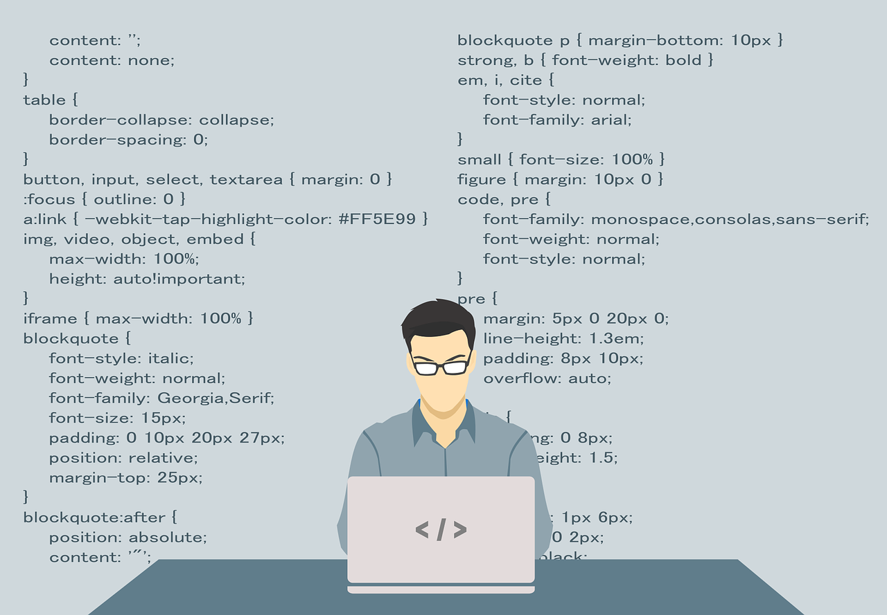
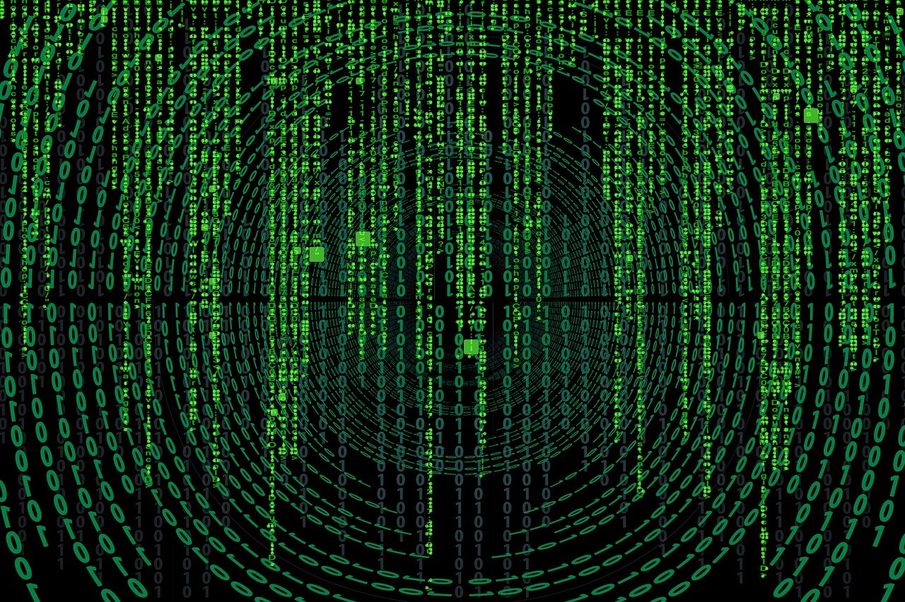

# ICS3U Curriculum - Grade 11 Computer Science Course Outline

ICS3U introduces students to computer science. The ICS3U Curriculum will have Grade 11 Computer Science students design software independently and as part of a team, using industry-standard programming tools and applying the software development life-cycle model. They will also write and use subprograms within computer programs. ICS3U1 students will develop creative solutions for various types of problems as their understanding of the computing environment grows. They will also explore environmental and ergonomic issues, emerging research in computer science, and global career trends in computer-related fields.

Grade 11 Computer Science is about how computers compute.  It is not about learning how to use the computer, and it is much more than computer programming.  Computer studies is the study of ways of representing objects and processes.  It involves defining problems, analyzing problems, designing solutions, and developing, testing, and maintaining programs.  The major focus of the ICS3U Curriculum is the development of programming skills, which are important for success in future postsecondary studies. Introduction to Computer Science is relevant for all students because it incorporates a broad range of transferable problem solving skills and techniques, including logical thinking, creative design, synthesis and evaluation.  It also teaches generically useful skills in areas such as communication, time management, organization, and teamwork.

You can read the entire [Ontario Computer Studies Curriculum](http://www.edu.gov.on.ca/eng/curriculum/secondary/computer10to12_2008.pdf) by visiting the Government of Ontario site.  The expectations identified for each course describe the knowledge and skills that students are expected to develop and demonstrate in their class work.

----

## ICS3U Unit 0 - The Computational Environment

### ICS3U Curriculum Learning Goals - Unit 0

By the end of this unit ICS3U Grade 11 Computer Science students will be able to

- Understand different types of computer software that exists on a computer
- Setup an organization system on your computer to store your files effectively
- Protect your data from malicious code
- Identify Software with Good and Bad Interfaces
- Explain the basic function of the major components that make up a computer system
- Understand how programming languages are used to interact with hardware
- Work with different types of number systems that computers use

### Lessons for ICS3U1 Grade 11 Computer Science - Unit 0

- Computer Software
- Computer Hardware
- Number Systems
- How Software Interacts with Hardware
- The Computational Environment Evaluation

### Grade 11 Computer Science - ICS3U Curriculum Expectations - Unit 0

ICS3U1 Specific Curriculum Expectations

<ul>
  <li>A1.2 – Demonstrate an understanding of how a computer uses various systems (e.g., binary, hexadecimal, ASCII, Unicode) to internally represent data and store information.</li>
  <li>C1.1 – Relate the specifications of the internal components of a computer (e.g., CPU, RAM, ROM, cache, hard drive, motherboard, power supply, video card, sound card) to user requirements.</li>
  <li>C1.2 – Relate computer specifications (e.g., processor type, bus speed, storage capacity, amount of memory) to user requirements, using correct terminology.</li>
  <li>C1.3 – Relate the specifications of common computer peripheral devices (e.g., printer, monitor, scanner, keyboard, mouse, speakers, USB flash drive) to user requirements.</li>
  <li>C1.4 – Identify the computer components involved in executing programming operations (e.g., assignment statements store a value in RAM, arithmetic operations are performed in the CPU).</li>
  <li>C2.1 – Use an operating system to organize computer programs and files logically on local and shared drives.</li>
  <li>C2.2 – Describe procedures to safeguard data and programs from malware (e.g., viruses, Trojan horses, worms, spyware, adware, malevolent macros), and devise a thorough system protection plan.</li>
  <li>C2.3 – Use standard procedures to back up and archive user files.</li>
  <li>C3.3 – Explain the difference between source code and machine code.</li>
  <li>C3.4 – Explain the difference between an interpreter and a compiler.</li>
  <li>C3.5 – Explain the difference between the functions of applications, programming languages, and operating systems.</li>
</ul>

----

## ICS3U Unit 1 - Programming with Variables and Math using Python

### ICS3U Curriculum Learning Goals - Unit 1

By the end of this unit ICS3U Grade 11 Computer Science students will be able to

- Download and install Python to your computer
Use an Integrated Development Environment to write a python program
- Print messages to the screen
- Use variables to store different types of numbers
- Use input statements to accept values from the keyboard
- Print both messages and the values of variables to the screen at the same time
- Add, subtract, multiply, and divide variables
- Round the value of variables to a certain # of decimal places
- Calculate powers and square roots
- Perform basic trigonometry calculations
- Generate random numbers between 2 values
- Write pseudo code using the input-processing-output method of problem solving.
- Write a documented python script to solve a specific mathematical problem
- Evaluate and verify that the coded solutions are correct

### Lessons for ICS3U1 Grade 11 Computer Science - Unit 1

- Python Programming Environments
- Screen Output
- Variables and Input
- Mathematical Calculations
- Programming Evaluation 1
- Develop Your Problem Solving Skills
- Programming Evaluation 2

### Grade 11 Computer Science - ICS3U Curriculum Expectations - Unit 1

 ICS3U1 Specific Curriculum Expectations

<ul>
  <li>A1.1 – Use constants and variables, including integers, floating points, strings, and Boolean values, correctly in computer programs.</li>
  <li>A1.3 – Use assignment statements correctly with both arithmetic and string expressions in computer programs.</li>
  <li>A2.1 – Write programs that incorporate user input, processing, and screen output.</li>
  <li>A3.1 – Demonstrate the ability to use existing subprograms (e.g., random number generator, substring, absolute value) within computer programs.</li>
  <li>A4.1 – Demonstrate the ability to identify and correct syntax, logic, and run-time errors in computer programs.</li>
  <li>A4.2 – Use workplace and professional conventions (e.g., naming, indenting, commenting) correctly to write programs and internal documentation.</li>
  <li>A4.3 – Demonstrate the ability to interpret error messages displayed by programming tools (e.g., compiler, debugging tool), at different times during the software development process (e.g., writing, compilation, testing).</li>
  <li>A4.4 – Use a tracing technique to understand program flow and to identify and correct logic and run-time errors in computer programs.</li>
  <li>A4.5 – Demonstrate the ability to validate a program using a full range of test cases.</li>
  <li>B1.1 – Use various problem-solving strategies (e.g., stepwise refinement, divide and conquer, working backwards, examples, extreme cases, tables and charts, trial and error) when solving different types of problems.</li>
  <li>B1.3 – Use the input-process-output model to solve problems.</li>
  <li>B2.1 – Design programs from a program template or skeleton (e.g., teacher-supplied skeleton, Help facility code snippet).</li>
  <li>B2.2 – Use appropriate vocabulary and mode of expression (i.e., written, oral, diagrammatic) to describe alternative program designs, and to explain the structure of a program.</li>
  <li>B3.1 – Design simple algorithms (e.g., add data to a sorted array, delete a datum from the middle of an array) according to specifications.</li>
  <li>B3.2 – Solve common problems (e.g., calculation of hypotenuse, determination of primes, calculation of area and circumference) by applying mathematical equations or formulas in an algorithm.</li>
  <li>B4.4 – Use a test plan to test programs (i.e., identify test scenarios, identify suitable input data, calculate expected outcomes, record actual outcomes, and conclude ‘pass’ or ‘fail’) by comparing expected to actual outcomes.</li>
  <li>C3.1 – Demonstrate an understanding of an integrated software development environment and its main components (e.g., source code editor, compiler, debugger).</li>
  <li>C3.2 – Work independently, using support documentation (e.g., IDE Help, tutorials, websites, user manuals), to design and write functioning computer programs.</li>
</ul>

----

## ICS3U Unit 2 - Programming With Python Control Structures

### ICS3U Curriculum Learning Goals - Unit 2

By the end of this unit, ICS3U Grade 11 Computer Science students will be able to:

- Understand the logic operators that will generate true or false statements
- Use variables to make comparison statements that evaluate to true or false
- Write if – else statements using simple and compound comparisons
- Trace through a flowchart of a loop and determine the value of the variables after the loop finishes
- Write while and for loops that execute code blocks a specific number of times
- Write loops that stop using a break statement, flag or conditional statement
- Write code that uses nested loop structures
- Write pseudo code using the input-processing-output method of problem solving.
- Write a documented python script to solve a specific mathematical problem
- Evaluate and verify that the coded solutions are correct

### Lessons for ICS3U1 Grade 11 Computer Science - Unit 2

- Selection Structures
- Programming Evaluation 3
- Repetition Structures
- Programming Evaluation 4
- Develop Your Problem Solving Skills
- Programming Evaluation 5

### Grade 11 Computer Science - ICS3U Curriculum Expectations - Unit 2

Grade 11 Computer Science - ICS3U Curriculum Expectations

<ul>
  <li>A1.1 – Use constants and variables, including integers, floating points, strings, and Boolean values, correctly in computer programs.</li>
  <li>A1.3 – Use assignment statements correctly with both arithmetic and string expressions in computer programs.</li>
  <li>A1.4 – Demonstrate the ability to use Boolean operators (e.g., AND, OR, NOT), comparison operators (i.e., equal to, not equal to, greater than, less than, greater than or equal to, less than or equal to), arithmetic operators (e.g., addition, subtraction, multiplication, division, exponentiation, parentheses), and order of operations correctly in computer programs.</li>
  <li>A2.1 – Write programs that incorporate user input, processing, and screen output.</li>
  <li>A2.2 – Use sequence, selection, and repetition control structures to create programming solutions.</li>
  <li>A2.3 – Write algorithms with nested structures (e.g., to count elements in an array, calculate a total, find highest or lowest value, or perform a linear search).</li>
  <li>A3.1 – Demonstrate the ability to use existing subprograms (e.g., random number generator, substring, absolute value) within computer programs.</li>
  <li>A4.1 – Demonstrate the ability to identify and correct syntax, logic, and run-time errors in computer programs.</li>
  <li>A4.2 – Use workplace and professional conventions (e.g., naming, indenting, commenting) correctly to write programs and internal documentation.</li>
  <li>A4.3 – Demonstrate the ability to interpret error messages displayed by programming tools (e.g., compiler, debugging tool), at different times during the software development process (e.g., writing, compilation, testing).</li>
  <li>A4.4 – Use a tracing technique to understand program flow and to identify and correct logic and run-time errors in computer programs.</li>
  <li>A4.5 – Demonstrate the ability to validate a program using a full range of test cases.</li>
  <li>B1.1 – Use various problem-solving strategies (e.g., stepwise refinement, divide and conquer, working backwards, examples, extreme cases, tables and charts, trial and error) when solving different types of problems.</li>
  <li>B1.3 – Use the input-process-output model to solve problems.</li>
  <li>B2.1 – Design programs from a program template or skeleton (e.g., teacher-supplied skeleton, Help facility code snippet).</li>
  <li>B2.2 – Use appropriate vocabulary and mode of expression (i.e., written, oral, diagrammatic) to describe alternative program designs, and to explain the structure of a program.</li>
  <li>B3.1 – Design simple algorithms (e.g., add data to a sorted array, delete a datum from the middle of an array) according to specifications.</li>
  <li>B3.2 – Solve common problems (e.g., calculation of hypotenuse, determination of primes, calculation of area and circumference) by applying mathematical equations or formulas in an algorithm.</li>
  <li>B3.3 – Design algorithms to detect, intercept, and handle exceptions (e.g., division by zero, roots of negatives).</li>
  <li>B4.4 – Use a test plan to test programs (i.e., identify test scenarios, identify suitable input data, calculate expected outcomes, record actual outcomes, and conclude ‘pass’ or ‘fail’) by comparing expected to actual outcomes.</li>
  <li>C3.1 – Demonstrate an understanding of an integrated software development environment and its main components (e.g., source code editor, compiler, debugger).</li>
  <li>C3.2 – Work independently, using support documentation (e.g., IDE Help, tutorials, websites, user manuals), to design and write functioning computer programs.</li>
</ul>

----

## ICS3U Unit 3 - Writing Modular Programs and Using Lists in Python

### ICS3U Curriculum Learning Goals - Unit 3

By the end of this unit, ICS3U Grade 11 Computer Science students will be able to:

- Create data using a list
- Access the data in a list and String using index values
- Use loops to efficiently access and modify values in a list and String
- Understand the basic idea behind top down analysis in problem solving.
- Take a larger problem and break it down into smaller modules
- Create a function that accepts parameters and returns a value
- Call functions from the main computer code and receive return values if necessary
- Write pseudo code using the input-processing-output method of problem solving.
- Write a documented python script to solve a specific mathematical problem
- Evaluate and verify that the coded solutions are correct

### Lessons for ICS3U1 Grade 11 Computer Science - Unit 3

- Lists and Strings
- Programming Evaluation 6
- Modular Programming
- Programming Evaluation 7
- Develop Your Problem Solving Skills

### Grade 11 Computer Science - ICS3U Curriculum Expectations - Unit 3

ICS3U1 Specific Curriculum Expectations

----

## ICS3U Unit 4 - Emerging Computer Technologies

### Learning Goals - Unit 4

By the end of this unit, ICS3U Grade 11 Computer Science students will be able to:

- Understand how a neural network acts like an artificial intelligence
- List some applications of how artificial intelligence will improve the computer science industry
- Identify skills and educational requirements are needed to succeed in the computer science industry

### Lessons for ICS3U1 Grade 11 Computer Science - Unit 4

- Emerging Technologies
- Emerging Technologies Evaluation

### Grade 11 Computer Science - ICS3U Curriculum Expectations - Unit 4

ICS3U1 Specific Curriculum Expectations

<ul>
  <li>D1.1 – Describe the negative effects of computer use on the environment (e.g., creation of e-waste, excessive use of paper from unnecessary printing, heavy power consumption) and on human health (e.g., radiation exposure, musculoskeletal disorders, eye strain, mental health issues, reduced activity levels).</li>
  <li>D1.2 – Identify measures that reduce the impact of computers on the environment (e.g., recycling policies, paperless workplaces) and human health (e.g., ergonomic standards).</li>
  <li>D1.3 – Describe ways computers can reduce resource use and support environmental protection (e.g., computer modeling, natural resource management).</li>
  <li>D1.4 – Identify government agencies and community partners that provide resources for environmental stewardship (e.g., recycling centers, companies refurbishing computers).</li>
  <li>D2.1 – Demonstrate an understanding of emerging areas of research in computer science (e.g., cryptography, AI, robotics, computer vision, GIS).</li>
  <li>D2.2 – Demonstrate an understanding of collaborative research between computer science and other fields (e.g., bioinformatics, economics, sociology).</li>
  <li>D2.3 – Report on a computer science-related area of research using an appropriate format (e.g., website, presentation, video).</li>
  <li>D3.1 – Research and describe career choices and trends in computer science at local, national, and international levels.</li>
  <li>D3.2 – Identify and report on experiential learning opportunities in computer science (e.g., co-op programs, job shadowing, career fairs).</li>
  <li>D3.3 – Research and report on postsecondary programs leading to careers in information systems and computer science (e.g., relevant institutions, industry certifications).</li>
  <li>D3.4 – Identify groups and programs supporting students pursuing non-traditional careers in information systems and computer science (e.g., mentoring programs, networking groups).</li>
  <li>D3.5 – Describe the Essential Skills and work habits important for success in computer studies as identified in the Ontario Skills Passport.</li>
</ul>

----

## ICS3U - Culminating Activity

### Learning Goals

By the end of this activity, ICS3U Grade 11 Computer Science students will be able to:

Demonstrate previously learned python programming and problem solving skills by solving a more complex problem

### Lessons for ICS3U1 Grade 11 Computer Science

- Culminating Activity Instructions

----

## ICS3U Curriculum - Assessment and Evaluation

The Ontario Ministry of Education document Growing Success determines the rules and policies for measuring and communicating achievement in Grade 11 Computer Science

The primary purpose of assessment and evaluation in Grade 11 Computer Science is to improve student learning.  Information gathered through assessment helps teachers to determine students strengths and weaknesses in their achievement or the overall ICS3U curriculum expectations.

### Assessment in Computer Science

The process of assessing student learning is continuous and on-going. Teachers use information gathered through assessments to provide feedback for students, to guide instruction and develop individual learning goals for students. This is assessment for learning. Students use this feedback to continuously improve their achievement and set individual learning goals. This is assessment as learning. Information from assessments informs the teacher’s professional judgment, but is not used in determining the student’s level of achievement.

### Evaluation in ICS3U

Evaluation is the process of determining a level of student achievement of the Overall Expectations for a course, which is recorded as a mid-term or final grade on a report card. Students will be given numerous and varied opportunities to demonstrate their achievement of the Overall Expectations, as defined in the ICS3U curriculum, across the four categories of achievement (Knowledge & Understanding, Thinking, Communication and Application).  Evidence of student achievement of the Overall Expectations is collected over time from three different sources – observations, conversations and student products.

To be successful students must demonstrate achievement of EACH of the Overall Expectations for the course. If a student is missing evidence of achievement of one or more of the Overall Expectations then a lower limit will be determined by the teacher.

Here are the overall expectations for ICS3U Introduction to Grade 11 Computer Science

ICS3U Curriculum - Strand A - Programming Concepts and Skills

<h4>Overall ICS3U Curriculum Expectations</h4>
<ul>
<li>A1 – Demonstrate the ability to use different data types, including one-dimensional arrays, in computer programs
<li>A2 – Demonstrate the ability to use control structures and simple algorithms in computer programs
<li>A3 – Demonstrate the ability to use control structures and simple algorithms in computer programs
<li>A4 – Use proper code maintenance techniques and conventions when creating computer programs
</ul>

ICS3U Curriculum - Strand B - Software Development

<h4>Overall ICS3U Curriculum Expectations</h4>
<ul>
<li>B1 – Use a variety of Problem Solving Strategies to solve different types of problems independently and as part of a team
<li>B2 – Design software solutions to meet a variety of challenges
<li>B3 – Design algorithms according to specifications
<li>B4 – Apply a software development life-cycle model to a software development project
</ul>

ICS3U Curriculum - Strand C - Computer Environments and Systems

<h4>Overall ICS3U Curriculum Expectations</h4>
<ul>
<li>C1 – Relate the specifications of computer components to user requirements
<li>C2 – Use appropriate file maintenance practices to organize and safeguard data
<li>C3 – Demonstrate an understanding of the software development process
</ul>

ICS3U Curriculum - Strand D - Topics in Computer Science

<h4>Overall ICS3U Curriculum Expectations</h4>
<ul>
<li>D1 – Describe policies on computer use that promote environmental stewardship and sustainability
<li>D2 – Demonstrate an understanding of emerging areas of computer science research
<li>D3 – Describe postsecondary education and career prospects related to computer studies
</ul>

### Report Card Grade

In determining a report card grade teachers use their professional judgment to interpret the evidence of student achievement which reflects the student’s most consistent level of achievement with special considerations given to the more recent evidence.

The final grade in this Grade 11 Computer Science course is determined by the following breakdown:

- 70 % – evaluations made at the end of units throughout the semester.

- 30% – final demonstrations of learning (culminating activities and/or final examinations)

All ICS3U assessments have been designed to meet the achievement chart categories in the Ontario ICS3U curriculum.

- **Knowledge and Understanding** – specific content acquired in the course and the comprehension of its meaning and significance.

- **Thinking** – The use of critical and creative thinking skills and processes.  It involves planning skills (focusing research, gathering information, selecting strategies, organizing a project).  Processing skills (analyzing, interpreting, assessing, reasoning, generating ideas, evaluating, synthesizing, seeking a variety of perspectives). Critical and creative thinking processes (problem solving, decision making, research)

- **Communication** – The conveying of meaning through various forms

- **Application** – The use of knowledge and skills to make connections within and between various contexts

The following are the Levels of Achievement for ICS3U:

- Level 4 (80% – 100%) Exceeds the provincial standard. The student demonstrates the specified knowledge and skills with a high degree of effectiveness.

- Level 3 (70% – 79%) The provincial standard for achievement. The student demonstrates the specified knowledge and skills with considerable effectiveness. Parents of students achieving at level 3 can be confident that their children will be prepared for work in subsequent grades/courses

- Level 2 (60% – 69%) Achievement that approaches the provincial standard. The student demonstrates the specified knowledge and skills with some effectiveness. Students performing at this level need to work on identified learning gaps to ensure future success.

- Level 1 (50% – 59%) Falls much below the provincial standard. The student demonstrates the specified knowledge and skills with limited effectiveness. Students must work at significantly improving learning in specific areas, as necessary, if they are to be successful in the next grade/course.

----

## Topics and Lessons in ICS3U Introduction to Computer Science Grade 11

### Course Content

#### ICS3U - Unit 0 - The Computational Environment

- ICS3U Computer Software

- ICS3U Computer Hardware

- ICS3U Number Systems

- ICS3U How Software Interacts with Hardware

- ICS3U Computational Environment Evaluation

#### ICS3U - Unit 1 - Programming with Variables and Math using Python

- ICS3U Python Programming Environments

- ICS3U Python Screen Output

- ICS3U Python Variables and Input

- ICS3U Python Mathematical Calculations

- ICS3U Python Programming Evaluation 1

- ICS3U Learning To Problem Solve With Python Part 1

- ICS3U Python Programming Evaluation 2

#### ICS3U - Unit 2 - Programming With Python Control Structures

- ICS3U Python Selection Structures

- ICS3U Python Programming Evaluation 3

- ICS3U Python Repetition Structures

- ICS3U Python Programming Evaluation 4

- ICS3U Learning To Problem Solve With Python Part 2

- ICS3U Python Programming Evaluation 5

#### ICS3U - Unit 3 - Writing Modular Programs and Using Lists in Python

- ICS3U Python Lists and Strings

- ICS3U Python Programming Evaluation 6

- ICS3U Modular Programming with Python

- ICS3U Python Programming Evaluation 7

- ICS3U Learning To Problem Solve With Python Part 3

#### ICS3U - Unit 4 - Emerging Computer Technologies & Problem Solving Portfolio

- ICS3U Emerging Technologies

- ICS3U Emerging Technologies Evaluation

- ICS3U Python Programming Evaluation 8

#### ICS3U - Final - Culminating Activity

- ICS3U Culminating Activity

- ICS3U Final Examination and Project
